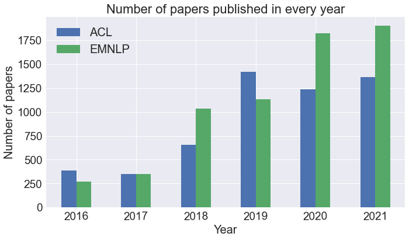
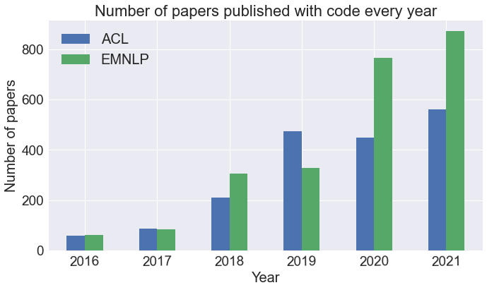
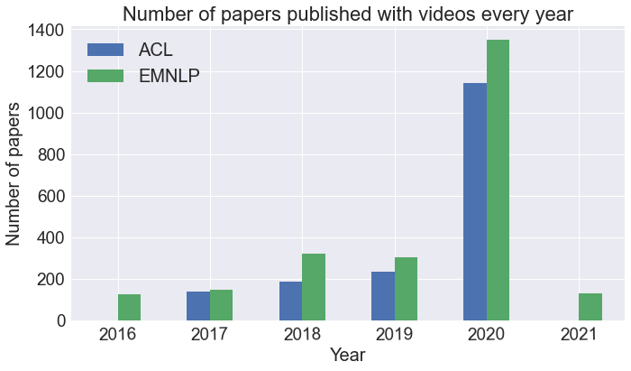

# Analyzing ACL and EMNLP papers
In this project, I have performed a text analysis of the papers published at ACL and EMNLP for the last 6 years, i.e., from 2016 to 2021. 

## About ACL and EMNLP
The Association for Computational Linguistics (ACL) is the international scientific and professional society for people working on problems involving natural language and computation. An annual meeting is held each summer in locations where significant computational linguistics research is carried out. It was founded in 1962, originally named the Association for Machine Translation and Computational Linguistics (AMTCL). It became the ACL in 1968.

Empirical Methods in Natural Language Processing (EMNLP) is a leading conference in the area of natural language processing and artificial intelligence. Along with the Association for Computational Linguistics (ACL), it is one of the two primary high-impact conferences for natural language processing research. EMNLP is organized by the ACL special interest group on linguistic data (SIGDAT) and was started in 1996, based on an earlier conference series called Workshop on Very Large Corpora (WVLC).

## Dataset (Hosted on [Kaggle](https://www.kaggle.com/datasets/manmeetkaur07/acl-emnlp-201621))
The dataset contains information on the various papers from both venues (ACL and EMNLP) that were published from 2016 until 2021 (last 5 years) and has been sourced from the official website of [ACL](https://aclanthology.org/).

### Data scraping
I created a web scraper in Python to scrape the data from the official website of ACL. After understanding the structure of the website (by looking at the source code) for a day, I decided on the components I required for my analysis and created a Python script to scrape the web pages.

### Data description
There are 18 columns in the dataset as follows:
1. 'Paper Title': The paper title for the manuscript.
2. 'Authors': The list of authors who published the manuscript.
3. 'Abstract': The abstract (summary) of the manuscript.
4. 'Volume': Name of the volume (special issue/ issue) in which the manuscript was published.
5. 'Month': The month in which the manuscript was published.
6. 'Year': The year in which the manuscript was published.
7. 'Address': The venue of the Conference/ Workshop proceedings.
8. 'Venues': The publication venue of the manuscript.
9. 'Pages': The page numbers of the manuscript in the Conference/ Workshop proceedings.
10. 'URL': ACL Anthology URL of the manuscript.
11. 'Publisher': Name of the publisher
12. 'Language': Language of the manuscript, if specified.
13. 'DOI': The DOI number of the manuscript.
14. 'DOI link': The complete URL of the DOI for the manuscript.
15. 'PDF Link': The PDF Link of the manuscript.
16. 'GitHub Link': The GitHub repository link associated with the manuscript, if specified.
17. 'Video Link': The presentation link for the manuscript, if specified.
18. 'Conference': Conference at which the manuscript has been published. (ACL/ EMNLP)

## Dependencies:
- python 3.7.12
- re 2.2.1
- nltk 3.2.5
- gensim 4.1.2
- sklearn 1.0.1

## Key Takeaways:
- The number of papers published at ACL was higher in 2016 and 2019 than EMNLP and equal in 2017. However, in 2018, 2020 and 2021, the number of articles published at EMNLP was higher than that at ACL.

- The number of GitHub repositories was approximately half the total number of papers submitted at these venues. They were almost equal in 2016 and 2017 at both venues, ACL leading in 2019 and EMNLP leading in 2018, 2020 and 2021.

- As for presentation links, before COVID-19, i.e., 2020, almost all conferences were in-person and did not have the same number of presentation video links compared to the number of papers published. In 2016 and 2021, there were no presentation links for the papers published at ACL, and EMNLP always had a higher number of papers with presentation links, noticing a sudden spike in 2021, as most of the conferences were conducted virtually.

- When checked for the top-10 bigrams in the title of the research articles submitted at both the venues, both of them had a similar set of keywords occurring in their titles, like, *‘(machine, translation)’, ‘(neural, machine)’, ‘(natural, language)’, ‘(question, answering)’* indicating similarities in the venues. Additionally, for ACL, task-based research articles were also published, like, SemEval-2021.
 
- The same trend can be noticed for the trigrams in the titles of the research articles for both the venues with the top ones being *‘(neural, machine, translation)’* and *‘(named, entity, recognition)’*.

 
